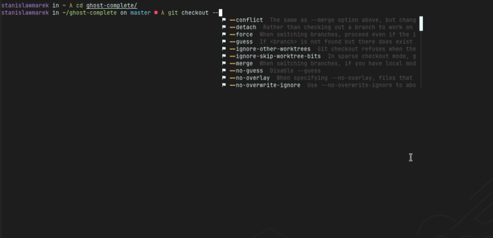
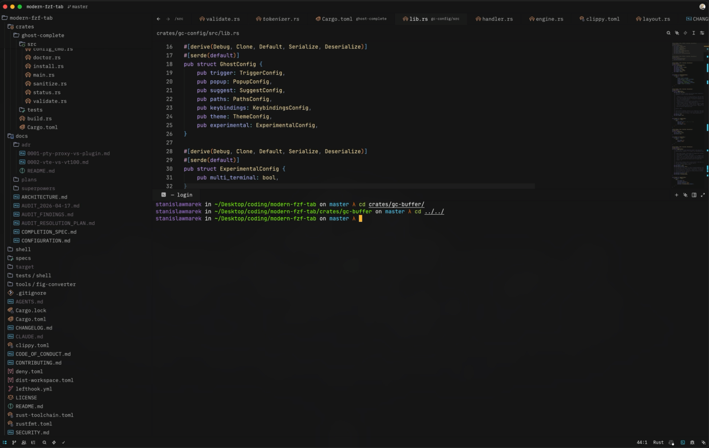

<div align="center">

# Ghost Complete

**Terminal-native autocomplete engine using PTY proxying for macOS terminals.**

[](https://github.com/StanMarek/ghost-complete/actions/workflows/ci.yml)
[](https://github.com/StanMarek/ghost-complete/releases/latest)
[](LICENSE)

[](https://github.com/StanMarek/ghost-complete/releases/download/v0.9.0/demo_ghost-complete.mp4)

<sub>Click to watch the demo (MP4, 2.5MB).</sub>

</div>

## Overview

Ghost Complete sits inside your terminal's data stream as a PTY proxy, intercepting I/O between your terminal emulator and your shell. When you type a command, it renders autocomplete suggestions as native ANSI popups — no macOS Accessibility API, no IME hacks, no Electron overlay. Just your terminal, your shell, and fast completions.

Inspired by the [Fig](https://fig.io) autocomplete experience. Built from scratch in Rust.

## Status

Ghost Complete is under active development. Contributions and bug reports are welcome.

- **9 supported terminals on macOS:** Ghostty, Kitty, WezTerm, Alacritty, Rio, iTerm2, Terminal.app, Zed, and VSCode (incl. VSCodium, Cursor, Windsurf, Positron) — all work out of the box with no additional configuration.
- **zsh is the primary shell.** Bash and fish support manual trigger only (Ctrl+/).
- **macOS only.** No Linux or Windows support planned at this time.
- **Pre-1.0.** Config format, spec format, and behavior may change between releases.

Found a bug? [Open an issue](https://github.com/StanMarek/ghost-complete/issues).

## Requirements

- **Terminal:** [Ghostty](https://ghostty.org), [Kitty](https://sw.kovidgoyal.net/kitty/), [WezTerm](https://wezfurlong.org/wezterm/), [Alacritty](https://alacritty.org), [Rio](https://raphamorim.io/rio/), [iTerm2](https://iterm2.com), or Terminal.app
- **OS:** macOS
- **Shell:** zsh (primary), bash and fish (Ctrl+/ trigger only)
- **Rust:** 1.86+ (for building from source)

## Installation

### Homebrew (recommended)

```bash
brew install StanMarek/tap/ghost-complete
ghost-complete install
```

### Shell installer

```bash
curl --proto '=https' --tlsv1.2 -LsSf https://github.com/StanMarek/ghost-complete/releases/latest/download/ghost-complete-installer.sh | sh
ghost-complete install
```

### Cargo

```bash
cargo install --git https://github.com/StanMarek/ghost-complete.git
ghost-complete install
```

### From source

```bash
git clone https://github.com/StanMarek/ghost-complete.git
cd ghost-complete
cargo build --release
cp target/release/ghost-complete ~/.cargo/bin/
ghost-complete install
```

### What `ghost-complete install` does

- Adds shell integration to `~/.zshrc` (auto-wraps your shell via PTY proxy)
- Deploys shell scripts for bash/fish to `~/.config/ghost-complete/shell/`
- Installs 709 completion specs to `~/.config/ghost-complete/specs/`
- Creates default config at `~/.config/ghost-complete/config.toml` (never overwrites existing)

### Uninstall

```bash
ghost-complete uninstall
brew uninstall ghost-complete  # if installed via Homebrew
```

## Quick Start

After installation, restart your terminal. Ghost Complete activates automatically in zsh.

- **Type a command** and suggestions appear after a short delay
- **Tab** to accept the selected suggestion
- **Enter** to accept and execute
- **Arrow keys** to navigate the popup
- **Escape** to dismiss
- **Ctrl+/** to manually trigger completions

Run `ghost-complete status` to see loaded specs and generator diagnostics.

### Supported Terminals

Ghost Complete auto-detects your terminal and selects the best rendering strategy. All supported terminals work out of the box — no config flag needed.

| Terminal | Rendering | Prompt Detection | tmux Support |
|----------|-----------|-----------------|:------------:|
| [Ghostty](https://ghostty.org) | Synchronized (DECSET 2026) | OSC 133 (native) | Yes |
| [Kitty](https://sw.kovidgoyal.net/kitty/) | Synchronized (DECSET 2026) | OSC 133 (native) | Yes |
| [WezTerm](https://wezfurlong.org/wezterm/) | Synchronized (DECSET 2026) | OSC 133 (native) | Yes |
| [Alacritty](https://alacritty.org) | Synchronized (DECSET 2026) | Shell integration | Yes |
| [Rio](https://raphamorim.io/rio/) | Synchronized (DECSET 2026) | OSC 133 (native) | — |
| [iTerm2](https://iterm2.com) | Pre-render buffer | Shell integration | Yes |
| Terminal.app | Pre-render buffer | Shell integration | No |
| [Zed](https://zed.dev) | Synchronized (DECSET 2026) | OSC 133 (native) | Yes |
| [VSCode](https://code.visualstudio.com) (and forks) | Synchronized (DECSET 2026) | OSC 133 (native) | Yes |

**Notes:**
- Terminal.app inside tmux is not detected (it sets no env var that leaks through tmux).
- Alacritty does not support OSC 133 natively; Ghost Complete uses its own shell integration markers instead. No functional difference — just a different detection path.
- VSCode detection covers **all Electron-based VSCode forks**: VSCodium, Cursor, Windsurf, Positron, Trae. They share the xterm.js frontend and shell integration model. Ghost Complete coexists with VSCode's own shell integration (OSC 633) — the proxy forwards editor sequences untouched so command decorations, sticky scroll, and "run recent command" continue to work.
- Unsupported terminals can be enabled with `[experimental] multi_terminal = true` in config.

<div align="center">

[](https://github.com/StanMarek/ghost-complete/releases/download/v0.9.0/zed_vscode_demo.mp4)

<sub>Ghost Complete running inside Zed and VSCode's integrated terminals. Click to watch (MP4, 3.5MB).</sub>

</div>

## Configuration

Config lives at `~/.config/ghost-complete/config.toml`:

```toml
[trigger]
auto_chars = [' ', '/', '-', '.']
delay_ms = 150

[popup]
max_visible = 10

[keybindings]
accept = "tab"
dismiss = "escape"
trigger = "ctrl+/"

[theme]
preset = "dark"  # dark, light, catppuccin, material-darker

[suggest]
max_results = 50
max_history_results = 5

[suggest.providers]
commands = true
filesystem = true
specs = true
git = true
```

Theme, keybindings, trigger chars, and popup dimensions are hot-reloaded. Other changes need a shell restart.

See [docs/CONFIGURATION.md](docs/CONFIGURATION.md) for the full reference.

## Completion Specs

Ghost Complete ships with 709 Fig-compatible JSON completion specs covering git, docker, cargo, npm, kubectl, brew, curl, ssh, and 700+ more — converted from the [Fig](https://fig.io) autocomplete ecosystem.

Beyond specs, built-in providers offer:
- **Environment variables** — `echo $HOM` → `$HOME`
- **SSH hosts** — parsed from `~/.ssh/config` with mtime caching
- **Shell alias resolution** — `alias g=git` → `g push` uses the git spec
- **Frecency-ranked history** — frequently/recently used commands score higher

Many specs include dynamic generators that run shell commands for live results (e.g., `brew list`, `docker ps`, `kubectl get`). Generator results are cached with configurable TTL. A loading indicator (`...`) appears while generators run.

Custom specs go in `~/.config/ghost-complete/specs/`. See [docs/COMPLETION_SPEC.md](docs/COMPLETION_SPEC.md) for the format reference.

## Architecture

Rust workspace with 8 crates:

| Crate | Role |
|-------|------|
| `ghost-complete` | Binary entry point, CLI, install/uninstall |
| `gc-pty` | PTY proxy event loop (portable-pty + tokio) |
| `gc-parser` | VT escape sequence parsing (vte), cursor/prompt tracking |
| `gc-buffer` | Command line reconstruction, context detection |
| `gc-suggest` | Suggestion engine with fuzzy ranking (nucleo) |
| `gc-overlay` | ANSI popup rendering with synchronized output |
| `gc-config` | TOML config, keybindings, themes |
| `gc-terminal` | Terminal detection, capability profiling, render strategy selection |

See [docs/ARCHITECTURE.md](docs/ARCHITECTURE.md) for the full design — data flow, dependency graph, key design decisions, and performance characteristics.

## Shell Support

| Feature | zsh | bash | fish |
|---------|-----|------|------|
| Auto-trigger on typing | Yes | No | No |
| Ctrl+/ manual trigger | Yes | Yes | Yes |
| PTY proxy wrapping | Yes | Yes | Yes |
| OSC 133 prompt markers | Yes | Yes | Yes |

## Known Limitations

- **Terminal.app inside tmux is not detected.** Terminal.app sets no environment variable that leaks through tmux, so Ghost Complete cannot identify it. Ghostty, Kitty, WezTerm, Alacritty, and iTerm2 in tmux work correctly via their respective env vars (`GHOSTTY_RESOURCES_DIR`, `KITTY_WINDOW_ID`, `WEZTERM_UNIX_SOCKET`, `ALACRITTY_SOCKET`, `ITERM_SESSION_ID`).
- **Dynamic generator results require a keystroke to render.** Async generators (shell commands for live results) merge into the popup on the next PTY read. If the shell is idle after the generator completes, results won't appear until the next keystroke.
- **Bash and fish: manual trigger only.** Auto-trigger on typing is not implemented for bash or fish. Use Ctrl+/ to manually invoke completions.
- **Specs with `requires_js: true` are partially functional.** Static completions (subcommands, options) work, but JS-based generators from the original Fig ecosystem are not executed.
- **No Linux or Windows support.** macOS only. The PTY proxy and terminal detection rely on macOS-specific behavior.

## FAQ

**How is this different from zsh/fish built-in autocomplete?**

Built-in completions work great — Ghost Complete doesn't replace them. It adds a visual popup layer on top, like the difference between typing from memory and having an IDE dropdown. Suggestions are fuzzy-ranked from multiple sources (completion specs, filesystem, git branches, command history) and displayed in a single view. Think of it as complementary, not a replacement.

**Why a PTY proxy instead of a zsh plugin?**

The PTY proxy sits between the terminal and the shell, rendering popups via pure ANSI escape sequences. This means no zle widget conflicts, no plugin manager dependencies, no RPROMPT corruption, and no fragile shell internals to hook into. It's more complex under the hood, but the UX is cleaner — one binary, works immediately after install.

**Why custom JSON specs instead of using the shell's built-in completions?**

Specs are declarative and fast — microsecond loads, no shell execution. They use the same format [Fig](https://fig.io) used, so there's a large existing ecosystem to draw from. Ghost Complete ships with 709 specs today, and many include dynamic generators that execute shell commands for live results (e.g., listing running containers, git branches, installed packages). Commands without a spec fall back to filesystem completions. Adding new specs is straightforward — see [docs/COMPLETION_SPEC.md](docs/COMPLETION_SPEC.md), and contributions are welcome.

**Where's the config documentation? I'm having popup alignment issues.**

Full config reference lives at [docs/CONFIGURATION.md](docs/CONFIGURATION.md). Running `ghost-complete install` generates a commented default config at `~/.config/ghost-complete/config.toml` with all available options.

For popup alignment: Ghost Complete uses ANSI cursor positioning within the terminal grid, so popups always track the cursor position directly. This avoids the window-level coordinate issues that plague Accessibility API approaches (the kind of drift reported with tools like Amazon Q / Kiro). If popups are misaligned, it's likely a terminal compatibility issue — please [open an issue](https://github.com/StanMarek/ghost-complete/issues) with your setup details.

## Logging

Ghost Complete logs through `tracing`. In proxy mode the default sink is a file under `$XDG_STATE_HOME/ghost-complete/ghost-complete.log` (falling back to `~/.local/state/ghost-complete/ghost-complete.log` when `XDG_STATE_HOME` is unset). stderr is not used by default in proxy mode, so log output never corrupts the terminal stream.

- `--log-level <trace|debug|info|warn|error>` sets the level (default: `warn`). Level hierarchy: `error` < `warn` < `info` < `debug` < `trace`.
- `--log-file <path>` overrides the default log path.
- `RUST_LOG` takes precedence over `--log-level`. It supports per-crate filters, e.g. `RUST_LOG=gc_suggest=debug,gc_pty=info`.

Tail the log in real time:

```bash
tail -f "${XDG_STATE_HOME:-$HOME/.local/state}/ghost-complete/ghost-complete.log"
```

Reporting a bug: run with `--log-level debug`, reproduce the issue, and attach the log file to your issue.

See [docs/CONFIGURATION.md](docs/CONFIGURATION.md#logging) for the full reference.

## Contributing

See [CONTRIBUTING.md](CONTRIBUTING.md).

## License

[MIT](LICENSE)

---

<div align="center">

## Star History

[](https://star-history.com/#StanMarek/ghost-complete&Date)

</div>
